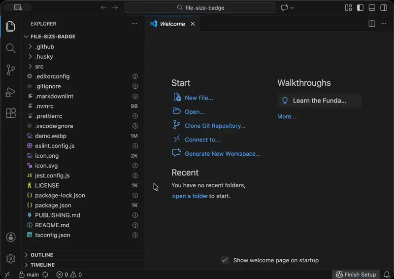

# File Size Badge

Displays file sizes as badges in the file explorer and shows the active file size in the status bar.

Compatible with VS Code and Cursor.

## Features

- Shows file sizes as badges next to files in the explorer
- Hover over files to see human-readable file sizes in tooltips
- Displays the size of the currently active file in the status bar

## License

MIT
